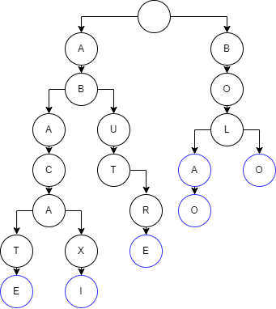

Trie (pronuncie "trái") é uma estrutura de dados bastante eficiente para armazenar palavras. Essa estrutura de dados também facilita a busca por prefixo em uma lista de palavras, imagine o seguinte problema:

Você possui uma lista de palavras:
- abacate
- abacaxi
- abutre
- bola
- bolo
- bolão

Nessa lista você precisa encontrar todas as palavras que começam com **"bol"**. Uma solução possível para resolver esse problema seria:

- Iterar cada palavra dessa lista
- Iterar por cada caractere da palavra enquanto o caractere atual for igual ao caractere do prefixo de busca

Com esse algoritmo, no pior caso, você precisará passar por todos os caracteres de todas as palavras. Esse algoritmo acaba não sendo tão eficiente caso você tenha uma lista com um número considerável de palavras. 

## Trie

A trie nos da uma forma eficiente de buscar palavras e isso é ideal para uma solução de auto-complete que busca palavras por um prefixo, veja como as palavras são armazenadas em uma trie:



Nesse diagrama temos as palavras:
- abacate
- abacaxi
- abutre
- bola
- bolo
- bolão


Veja que também otimizamos o armazenamento de memória pois palavras que tenham o mesmo prefixo não serão armazenadas múltiplas vezes.

Outro detalhe importante é que todos os caracteres que são finais de alguma palavra estão na cor **azul**, quando implementarmos o código da trie isso poderá ser um valor booleano e poderá ajudar caso seja necessário buscar por uma palavra completa.

## Algoritmo

A trie possui uma estrutura de uma árvore e cada ramo dessa árvore possui ponteiros que irão apontar para os caracteres possíveis a partir desse ramo.

Acaba ficando mais simples fazer uma busca por prefixo usando essa estrutura de dados, podemos utilizar a seguinte solução:

- Iterar cada caractere do prefixo de busca
- Continuar enquanto o caractere atual do prefixo existir no ramo atual da trie

Apenas precisamos iterar por todos os caracteres do prefixo de busca, não importa o tamanho da trie, uma vez que iterarmos por todos os caracteres do prefixo de busca, podemos exibir o restante dos ramos dessa trie pois os ramos seguintes possuem o mesmo prefixo.

Em javascript esse seria um algoritmo que implementa a solução de auto-complete:
```js
searchPrefix(prefix) {
  // Define a raiz da árvore como o inicio da busca
  let currentNode = this.root;

  // Itera por cada caractere do prefixo de busca
  for (let i = 0; i < prefix.length; i++) {
    // Se o caractere atual não existir no ramo atual da árvore, retorna uma lista vazia
    if (currentNode.children.get(prefix[i]) === undefined) {
      return [];
    }
    
    // Define o próximo ramo de busca
    currentNode = currentNode.children.get(prefix[i]);
  }

  // Se todos os caracteres do prefixo foram iterados, significa que o prefixo existe na Trie
  // Esse método realiza uma busca em profundidade (DFS) no restante da árvore para apresentar como auto-complete 
  return this.wordsToAutocomplete(prefix, currentNode);
}

// Método que utiliza busca em profundidade (DFS) a partir de um nó e exibe todas as palavras a partir desse nó 
// Solução ideal para retornarmos palavras que podem completar um prefixo
wordsToAutocomplete(prefix, node) {
  // Aqui utilizamos uma pilha para fazer a busca em profundidade (a última letra adicionada vai ser a próxima letra consumida)
  const stack = [];

  // Guardamos uma lista com todas as palavras completas, esse será o nosso retorno
  const matches = [];

  // Se a letra atual for o final de alguma palavra na Trie, devemos adicionar à nossa variável de retorno também
  if (node.endOfWord) {
    matches.push(prefix);
  }

  // Começamos adicionando na nossa pilha todas as letras que o nó atual faz apontamento
  for (let [key, child] of node.children) {
    stack.push([key, child, []]);
  }

  // Enquanto tiver letras nessa pilha, vamos consumir elas
  while (stack.length > 0) {
    // Cada elemento da pilha terá 3 variáveis de controle
    // Sempre mantemos a letra atual, o nó atual
    // E uma referência para um stringBuilder, pois conforme passamos pela pilha vamos construindo uma palavra com as letras encontradas
    let [char, node, currentWord] = stack.pop();

    // E sempre vamos adicionando a letra atual ao stringBuilder
    currentWord.push(char);

    // Se a letra atual for o final de alguma palavra, podemos completar o stringBuilder
    // E adicionar a palavra completa à nossa variável de retorno
    if (node.endOfWord) {
      matches.push(currentWord.join(""));
    }

    // E adicionamos todas as letras que o nó atual faz apontamento
    // Para que a pilha continue consumindo o restante das letras
    for (let [key, child] of node.children) {
      stack.push([key, child, [...currentWord]]);
    }
  }

  // Por fim, retornamos todas as palavras encontradas a partir do nó recebido
  return matches;
}
```

Agora como exemplo, você pode utilizar essa demo para adicionar palavras e digitar em um campo de busca para mostrar o auto-complete:

<iframe src="https://autocomplete-com-trie.netlify.app/" width="100%" height="500px" style="border: 1px solid #ccc;"></iframe>

Caso não consiga visualizar o exemplo, acesse o link externo: [https://autocomplete-com-trie.netlify.app/](https://autocomplete-com-trie.netlify.app/)

Para ver a implementação do auto-complete com trie, esse é o código fonte:
[https://github.com/gustavocstl/autocomplete-trie-live-example](https://github.com/gustavocstl/autocomplete-trie-live-example)

## Links Úteis
- [Tries (árvores digitais)](https://www.ime.usp.br/~pf/estruturas-de-dados/aulas/tries.html)
- [Tries - Introdução](https://www.geeksforgeeks.org/introduction-to-trie-data-structure-and-algorithm-tutorials/)
- [Busca em Profundidade (DFS)](https://www.ime.usp.br/~pf/algoritmos_para_grafos/aulas/dfs.html)
