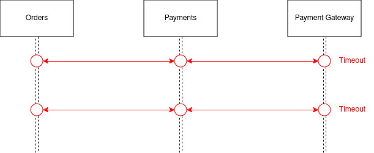
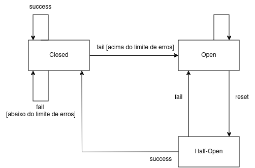
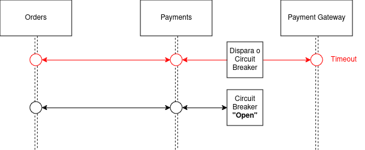
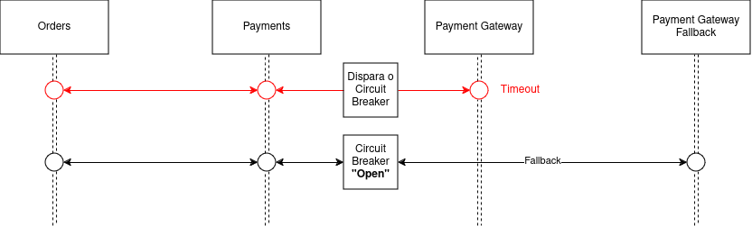

Imagine um serviço que está com algum problema para processar as requisições e acaba retornando timeouts.
Neste caso, ficar fazendo a mesma requisição pode degradar ainda mais o serviço e acabar consumindo recursos desnecessários.
Além disso, este serviço problemático pode acabar desencadeando falhas em cascata em todos os serviços que fazem parte da mesma requisição.

O padrão **Circuit Breaker** pode resolver esse problema, bloqueando as chamadas que estão fadadas à falharem.

Podemos traduzir circuit breaker para disjuntor, e o princípio é o mesmo:

> *Detectar uso excessivo, falhar primeiro e abrir o circuito.
Mais abstratamente, o Circuit Breaker existe para permitir que um subsistema (um circuito
elétrico) falhe (consumo excessivo de corrente, possivelmente de um curto-circuito) sem
destruir o sistema inteiro (a casa). Além disso, uma vez que o perigo tenha
passado, o disjuntor pode ser reiniciado para restaurar a função completa do sistema.*

<em>Texto retirado do livro <strong>Release It! (Michael Nygaard 2018)</strong></em>

Veja o seguinte cenário, o serviço **Orders** se comunica com o serviço **Payments** que se comunica com o **Payment Gateway**:

Se por algum motivo o **Payment Gateway** demorar para responder e retornar um timeout, teremos uma falha no **Payments** que também irá retornar um timeout e desencadear uma falha no **Orders**.

Essas falhas em cascata irão acontecer para todas as requisições, mesmo sabendo que nenhuma delas vão conseguir completar com sucesso e isso é um problema, pois uma vez que sabemos que o **Payment Gateway** está com problemas, podemos **falhar antes** e evitar o gasto de recursos desnecessário até que o **Payment Gateway** volte ao seu estado normal.

Para resolver isso podemos utilizar o circuit breaker para lidar com essa comunicação entre **Payments** e **Payment Gateway**. 

O circuit breaker possui 3 estados:

**Closed**: Todas as requisiçẽs irão passar. Se a chamada retornar algum erro, um contador será incrementado. Caso nenhum erro seja retornado, o contador será resetado. Se o contador atingir um limite, o estado é alterado para **Open**.

**Open**: Todas as requisições falham imediatamente, sem que qualquer chamada seja realizada. A falha pode ser um retorno de uma mensagem para que o cliente entenda o que aconteceu. Após um período de tempo o estado é alterado para **Half-Open**.

**Half-Open**: Quando este estado está ativo, a próxima requisição irá tentar chamar o serviço com problema, se a chamada retornar um erro, o estado volta para **Open**. Caso nenhum erro seja retornado, o contador é resetado e o estado é alterado para **Closed**.

Veja como fica o diagrama de sequência com o circuit breaker:

Veja que o serviço problemático (**Payment Gateway**) nem foi chamado, pois a requisição anterior pegou o timeout e disparou o circuit breaker que alterou o estado para **Open**. Com isso as próximas requisições não serão liberadas pelo circuit breaker, neste caso uma mensagem de erro pode ser retornada.

Também quando o circuit breaker está no estado **Open**, ao invés de retornar uma mensagem, podemos definir alguma estratégia de alternativa, por exemplo, podemos definir para que o circuit breaker chame um outro **Payment Gateway** para tentar completar o pagamento sem que o cliente seja afetado.

Entretanto esta é uma decisão que deve ser tomada levando em conta as decisões de negócio. Dependendo das regras de negócio é necessário saber se é aceitável pensar em alternativas caso a primeira opção falhe.

Por fim, todas as alterações de estado no circuit breaker precisam ser logadas e monitoradas. A frequência que um circuit breaker altera seu estado pode ser uma ótima métrica para identificar possíveis problemas. Também é possível medir a quantidade de chamadas e tempos de respostas com um circuit breaker.

## Links Úteis

- [Circuit Breaker - Martin Fowler](https://martinfowler.com/bliki/CircuitBreaker.html)
- [Release It!: Design and Deploy Production-Ready Software](https://www.amazon.com.br/Release-Design-Production-Ready-Software-English-ebook/dp/B079YWMY2V)
