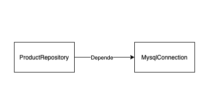
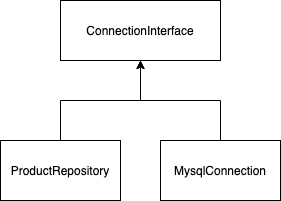

## O que é uma dependência?

Imagine a classe `ProductRepository`, essa classe precisa executar ações em um banco de dados e essas ações estão implementadas em uma outra classe chamada `MysqlConnection`. 

Podemos dizer que `MysqlConnection` é uma dependência de `ProductRepository`.



Uma forma fácil, mas **não ideal** de implementar isso poderia ser:
```php
class MysqlConnection
{
    ...
    public function query()
    {
        ...
    }
}
```
```php
class ProductRepository 
{
    private MysqlConnection $connection;

    public function __construct()
    {
        $this->connection = new MysqlConnection();
    }

    public function update(int $productId, array $changes)
    {
        $this->connection->query('...');
    }
}
```

Perceba que é criada uma instância da classe `MysqlConnection` no método `__construct`.
Isso cria um [forte acoplamento](https://pt.stackoverflow.com/questions/193420/o-que-%C3%A9-acoplamento-entre-classes) com a classe `MysqlConnection`.

Se o construtor da classe `MysqlConnection` for alterado, você também terá que mexer na classe `ProductRepository` e isso fere um princípio do SOLID que é o *[princípio da responsabilidade única](https://pt.stackoverflow.com/questions/100516/o-que-%C3%A9-e-como-se-usa-o-srp/101591)*.

Também quando for escrever os casos de testes para essa classe, será díficil escrever pois para qualquer teste será criado uma instância de outra classe que não tem relação com o teste.

O ideal é que para criar testes para a classe `ProductRepository` a gente não necessite da classe `MysqlConnection` e muito menos de um banco de dados real. Todas essas dependências devem ser [mocks](https://pt.wikipedia.org/wiki/Objeto_mock).

## Injeção de Dependência

Com a injeção de dependência podemos melhorar um pouco isso, pois mudaremos a forma que a dependência é passada para a classe.

Veja como fica usando injeção de dependência:
```php
class ProductRepository
{
    private MysqlConnection $connection;

    public function __construct(MysqlConnection $connection)
    {
        $this->connection = $connection;
    }
    ...
}
```

Agora `ProductRepository` precisa receber como paramêtro a `MysqlConnection` para inicializar, isso implementa a injeção de dependência e melhora um pouco, mas a classe continua dependendo de uma implementação concreta de `MysqlConnection` e ainda não está sendo respeitado o *[princípio da inversão de dependência](https://pt.stackoverflow.com/questions/101552/o-que-%C3%A9-princ%C3%ADpio-da-invers%C3%A3o-de-depend%C3%AAncia-dip)*.

## Inversão de Controle

A inversão de controle é o que foi mostrado no exemplo acima. O **controle de quem injeta as dependências foi invertido**, pois agora o único responsável por injetar é quem irá utilizar a classe, mas ainda continuamos com o problema mencionado acima, a classe continua recebendo uma implementação concreta de `MysqlConnection`. Veja como isso é resolvido com a **inversão de dependência**.

## Inversão de Dependência

O princípio da inversão de dependência diz que uma classe deve depender de abstrações e não de implementações concretas.

Para resolver o problema do exemplo acima, precisamos criar uma `interface` que define o comportamento da classe e então depender apenas dessa `interface`.
Dessa forma **invertemos as dependências**, pois o `ProductRepository` vai depender somente da `interface` e `MysqlConnection` vai depender da `interface` para implementar os comportamentos.



```php
class MysqlConnection implements ConnectionInterface
{
    ...
    public function query()
    {
        ...
    }
}
```
```php
class ProductRepository
{
    private $connection;

    public function __construct(ConnectionInterface $connection)
    {
        $this->connection = $connection;
    }

    public function update(int $productId, array $changes)
    {
        $this->connection->query('...');
    }
}
```

Isso faz com que a classe `ProductRepository` não precise saber quem é a `MysqlConnection` e também nos permite mudar o banco de dados com um pouco mais de facilidade no futuro, por exemplo.
Apenas devemos implementar a interface `ConnectionInterface` que o nosso repositório saberá lidar.

## Container

Chegamos ao final e na parte onde facilitamos toda essa implementação. Gosto muito de como funciona o container para injeção de dependências, pois é algo muito simples de implementar e que melhora bastante tanto em organização como para mudanças futuras.

O container pode ser muito útil em aplicações grandes pois facilita alterações e centraliza o lugar onde as dependências são inseridas.

O único responsável por injetar dependências nas classes será o container. A instância do container terá a relação de todas as classes que a aplicação precisa.

Então basta solicitar uma classe para o container e ele devolverá a instância da classe com todas as dependências injetadas.

Veja a classe do `Container` como é implementada:
```php
final class Container
{
    private $factories = [];
    private $instances = [];

    public function register($key, $factory)
    {
        if (array_key_exists($key, $this->factories)) {
            throw new KeyAlreadyRegisteredError("Key $key already registered.");
        }

        $this->factories[$key] = $factory;
    }

    public function get($key)
    {
        if (array_key_exists($key, $this->instances)) {
            return $this->instances[$key];
        }

        if (!array_key_exists($key, $this->factories)) {
            throw new KeyNotRegisteredError("Key $key is not registered.");
        }

        $this->instances[$key] = $this->factories[$key]($this);
        return $this->instances[$key];
    }
}
```

Também pode ser criada uma classe responsável por registrar as classes no container. Chamamos ela de `ServiceProvider`:

```php
final class ServiceProvider
{
    public function register(Container $container)
    {
        $container->register(MysqlConnection::class, function() {
            return new MysqlConnection();
        });

        $container->register(ProductRepository::class, function(Container $container) {
            return new ProductRepository($container->get(MysqlConnection::class));
        });
    }
}

$container = new Container();
$provider = new ServiceProvider();
$provider->register($container);
```

Para utilizar o `ProductRepository` do container basta chamar:

```php
$productRepository = $container->get(ProductRepository::class);
```

E então será retornado uma instância do `ProductRepository` já com as dependências injetadas.

Veja que desacoplamos as dependências da nossa classe e agora ficou muito mais simples para escrever testes e reutilizar a classe com as dependências já injetadas pelo container.

Esses são exemplos básicos do uso de container para injeção de dependências, existem diversas bibliotecas para implementar o container de forma mais performática dependendo da utilização e linguagem, mas o conceito e a ideia permanece.


## Links Úteis

- [Martin Fowler - Inversion of Control Containers and the Dependency Injection pattern](https://martinfowler.com/articles/injection.html)
