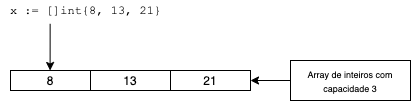
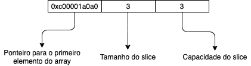

Um slice possui em sua estrutura um ponteiro para um índice de um array.



Arrays são definidos com um tamanho fixo `var x [3]int`, já os slices nos permite manipular esses arrays como se fossem dinâmicos.

## Declarando slices:

Com a declaração `x := []int{8, 13, 21}` criamos um novo slice, repare que não precisamos declarar o tamanho para o slice. Isso irá criar um novo array na memória e o slice receberá um ponteiro para o primeiro índice do array.

Esse slice irá ser definido como:



Veja que a capacidade do slice é 3, mas e se por exemplo tentarmos adicionar um novo elemento:
```go
x := append(x, 34)
```

Então será criado um novo array com o tamanho **4** e com o dobro de capacidade (**6**) e todos os outros elementos serão copiados para esse novo array, o anterior será removido e o novo slice será criado.

```go
x := []int{8, 13, 21}

fmt.Printf("x: %v, len: %d, cap: %d\n", x, len(x), cap(x))

x = append(x, 34)

fmt.Printf("x: %v, len: %d, cap: %d\n", x, len(x), cap(x))
```
```sh
x: [8 13 21], len: 3, cap: 3
x: [8 13 21 34], len: 4, cap: 6
```

Podemos tentar evitar que esse processo aconteça criando slices com tamanhos e capacidades já definidas usando a função [make](https://tour.golang.org/moretypes/13).

## Criando um slice com base em outro


Podemos também criar um slice com base em outro slice, veja como ficaria:


Declaramos `y := x[1:2]` e esse slice não irá criar um novo array, ele receberá o ponteiro para o índice **1** do array na memória.

O novo slice terá acesso aos elementos `[13, 21]`.

Essa operação, chamada de dividir (slicing), não tem um custo alto pois ela não aloca memória, deixando somente na stack de chamadas e utiliza o ponteiro para o array já alocado.

Exemplos:
```go
x := []int{8, 13, 21}
y := x[1:3]

fmt.Printf("x: %v, y: %v\n", x, y)
fmt.Printf("lenX: %d, capX: %d\n", len(x), cap(x))
fmt.Printf("lenY: %d, capY: %d\n", len(y), cap(y))
```

```sh
x: [8 13 21], y: [13 21]
lenX: 3, capX: 3
lenY: 2, capY: 2
```

## Referências

- [Effective Go - Slices](https://golang.org/doc/effective_go#slices)
- [Go Slices: usage and internals](https://blog.golang.org/slices-intro)
- [Go By Example - Slices](https://gobyexample.com/slices)
- [Go By Example - Arrays](https://gobyexample.com/arrays)
- [Capacidade de slices em Golang](https://pt.stackoverflow.com/questions/262440/capacidade-de-slices-em-golang)