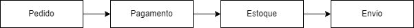
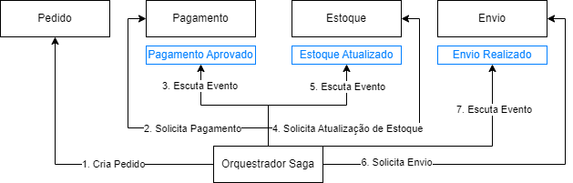
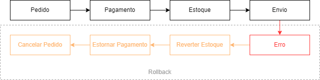

O padrão saga é utilizado para lidar com transações distribuídas entre microserviços. Em uma arquitetura de microserviços, uma única requisição pode ser dividida entre vários microserviços com o objetivo final de concluir aquela requisição com sucesso, porém em qualquer parte desse fluxo podem ocorrer falhas e esses microserviços precisam saber como lidar com essas falhas.

Neste post vamos falar sobre o padrão saga **com orquestração**. A orquestração também ajuda a resolver o problema de comunicação entre vários domínios de negócio, uma vez que nenhum domínio deveria falar diretamente com outro domínio ou até mesmo nenhum domínio precisaria conhecer outro domínio. 

Imagine um sistema de ecommerce onde cada compra tem um ciclo de vida que envolve desde a **criação do pedido** até o **envio** e durante esse fluxo múltiplos serviços de diferentes domínios podem ser envolvidos:

Neste exemplo, os serviços de **pedido** não deveriam conhecer e nem mesmo saber como funcionam os serviços de **pagamento**.

Quem irá fazer esse papel de comunicar com cada domínio é o próprio orquestrador saga, ele será o responsável por saber em qual etapa aquele fluxo está e para onde ele precisa ir. Também saberá qual é o serviço que deve ser chamado e como essa chamada deverá ser feita: 

Veja que o fluxo no orquestrador é separado por **etapas** e cada **etapa** é executada sequencialmente. O orquestrador está sempre aguardando um evento acontecer para saber quando executar a próxima **etapa**. Também vemos aqui que o orquestrador funciona muito bem em uma arquitetura orientada à eventos.

Note que todas as comunicações são centralizadas no orquestrador, nenhum domínio precisa conhecer o outro.

## Compensações (ou rollbacks)

Agora imagine que, por algum motivo, o serviço de **envio** teve um problema e agora todo o ciclo de vida daquela compra precisa ser revertido de alguma forma, por exemplo, reverter a atualização de **estoque**, estornar o **pagamento**, cancelar o **pedido** e etc. 

No contexto do saga, ações que envolvem resolução de erros, são chamadas de **compensações**. É possível imaginar um fluxo inverso realizando ações para compensar as falhas ocorridas no fluxo:

Nesse cenário de erro, o orquestrador também é o responsável por avisar os outros serviços que as ações **compensatórias** precisam ser realizadas, como se fosse um **rollback** em uma transação.

---

Essa foi uma breve introdução desse padrão que pode ser utilizado para resolver problemas de consistência de dados entre os microserviços com transações distribuídas. Também resolve o problema de múltiplos domínios não precisarem se conhecer e facilita a criação de múltiplos fluxos de negócio.

Algumas das desvantagens desse padrão é que existe uma complexidade em implementar e manter essa lógica de orquestrar os serviços e também existe um ponto único de falha que é o próprio orquestrador gerenciando todo o fluxo.

## Links Úteis

- [Pattern: Saga - microservices.io](https://microservices.io/patterns/data/saga.html)
